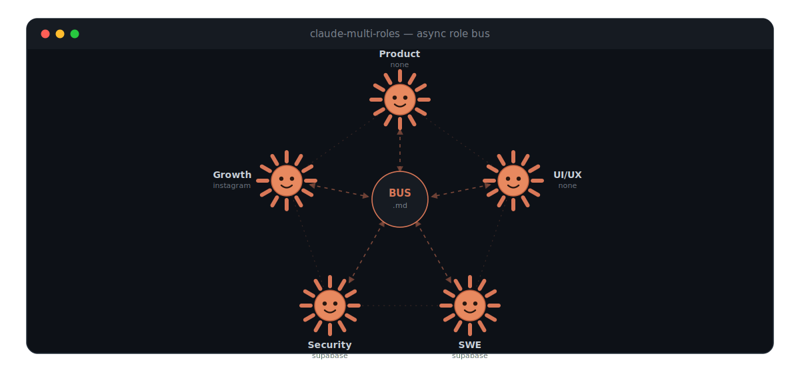

<div align="center">

# claude-multi-roles

[](LICENSE) [](https://docs.anthropic.com/en/docs/claude-code) [](https://nodejs.org) [](#)

### One Claude Code project. Five focused roles. One async memory bus.

**A multi-role Claude Code orchestration framework with per-session dynamic MCP scoping and async inter-role communication.**



</div>

> ### 🟠 Why this exists
> This repository is a **worked example, not a rigid product.** It's the 5-role setup I built to run an entire full-stack platform for a **~100k-follower Instagram page** — end to end, inside Claude Code, on a single **Pro** subscription. That project needed very different tools at different moments: a **Vercel / frontend** MCP while shipping UI, the **Meta / Instagram API** while analyzing growth, **Supabase** for data and security. Loading them all into every session was wasteful (token bloat) and noisy. So each role boots with **only** the MCP servers it actually needs, and hands work to the next role through a written log instead of a shared brain.
>
> **The five roles below are an example.** Keep them, reshape them, add a sixth, or wire in completely different MCP servers — the machinery (dynamic MCP scoping + the BUS pattern + the safety backstop) is what's reusable. See [Customization](#customization).

```
 ═══════════════════════════════════════════════════════════
   claude-multi-roles — select the session role
 ═══════════════════════════════════════════════════════════
   1) Product Manager      4) Security Engineer
   2) UI/UX Developer      5) Growth Marketer
   3) SWE
 Role > 2

 ◆ Active role:    2-UI/UX Developer
 ◆ MCP connectors: none

 ▶ Launching Claude Code…  reading  ROLE.md → MEMORY.md → STATE → BUS
```

---

## Contents

1. [The Problem It Solves](#the-problem-it-solves)
2. [How It Works](#how-it-works)
3. [The 5 Roles](#the-5-roles)
4. [The BUS.md Pattern](#the-busmd-pattern)
5. [Dynamic MCP Scoping](#dynamic-mcp-scoping)
6. [Prerequisites](#prerequisites)
7. [Installation](#installation)
8. [First Session — End to End](#first-session--end-to-end-example)
9. [Safety](#safety)
10. [Customization](#customization)
11. [Contributing](#contributing) · [License](#license)

---

## The Problem It Solves

**Token bloat from always-on MCP servers.** A typical Claude Code setup loads every configured MCP server into every session. A Supabase connector, an Instagram connector, a filesystem connector — all of them inflate the context window and the tool list before you've typed a single word, whether or not the current task needs them. The model pays attention tax on tools it will never call. `claude-multi-roles` loads **only** the MCP servers a given role needs, swapping `.mcp.json` at launch so a design session never sees database tools and a backend session never sees social-media tools.

**Shared, mutable memory in classic multi-agent setups.** When several agents write to one shared scratchpad, they overwrite each other's context, leak private reasoning, and drift out of sync. This framework gives each role a **private** `MEMORY.md` that only that role writes, and a single **append-only** `BUS.md` that everyone reads. Roles never read each other's private memory — they communicate through explicit, timestamped broadcasts. The result is durable, auditable handoffs instead of a contested whiteboard.

**No backstop behind `--dangerously-skip-permissions`.** Running Claude Code with permissions skipped is fast but unguarded — one bad `rm -rf`, `DROP TABLE`, or `git push --force` and you've lost work or shipped a mistake. `claude-multi-roles` keeps the speed of skipped permissions but adds a **deterministic `PreToolUse` hook** (`safety-check.sh`) that pattern-matches every Bash command and hard-blocks the irreversible ones, regardless of what the model decides. The autonomy stays; the cliff edge gets a railing.

---

## How It Works

```
 ./multiroles
     │
     ▼
 ┌─────────────────────┐
 │ choose a role (1-5) │
 └─────────┬───────────┘
           │  envsubst < mcp-configs/<role>.json > .mcp.json
           ▼
 ┌─────────────────────┐
 │ write .mcp.json      │  ← only this role's MCP servers
 │ write active-role.txt│
 └─────────┬───────────┘
           │  exec claude --dangerously-skip-permissions
           ▼
 ┌──────────────────────────────────────────────┐
 │ SESSION                                        │
 │  read: ROLE.md → MEMORY.md → STATE → DECISIONS │
 │        → last 20 events of BUS.md              │
 │  work within role scope                        │
 │  every Bash cmd ⟶ safety-check.sh (backstop)   │
 └─────────┬────────────────────────────────────┘
           │  Stop hook fires
           ▼
 ┌──────────────────────────────────────────────┐
 │ session-end: quality gate (0–10, threshold 7) │
 │  update MEMORY.md (private)                    │
 │  broadcast to BUS.md (if others are affected)  │
 │  update STATE.md / DECISIONS.md                │
 │  write commands/next-session-<role>.md         │
 └─────────┬────────────────────────────────────┘
           ▼
        commit  →  loop closes
```

---

## The 5 Roles

| Role | Responsibility | Active MCP | Can do | Cannot do |
|---|---|---|---|---|
| **1 · Product Manager** | The *why* and *what*: roadmap, specs, acceptance criteria | _none_ | Own `DECISIONS.md`, read all private memories | Write code, touch DB/schema, run bash |
| **2 · UI/UX Developer** | Design, frontend, design system, brand assets | _none_ | Components, layouts, accessibility, `assets/` | Backend, DB/schema, auth logic, product calls |
| **3 · SWE** | Backend, data layer, API, integrations, mock→real | `supabase` | Build APIs, data layer, real auth middleware | Touch UI/JSX, deploy to prod without sign-off |
| **4 · Security Engineer** | RLS, auth, OWASP, app-role isolation | `supabase` (read) | Review, audit, patch vulnerabilities | Build new features, change schema unannounced |
| **5 · Growth Marketer** | Acquisition, retention, analytics, social | `instagram` | Analyze funnels, define CAC/LTV/retention | Touch code/DB, publish content autonomously |

**1 · Product Manager** owns the product's *why* and *what*. It writes roadmaps, specs, and measurable acceptance criteria, and it is the only role allowed to author `DECISIONS.md` (the architectural decision records). It writes no code and runs no commands — it directs the other four roles.

**2 · UI/UX Developer** turns PM specs into interfaces. It owns components, pages, layout, the design system, accessibility, and brand assets under `.claude/assets/`. Its golden rule: migrating from mock data to real data must not change a single line of JSX — when the data shape changes, the `.data.ts` signature adapts, never the component.

**3 · SWE** makes things actually work. It owns the backend, data layer, APIs, external integrations, and real auth middleware, replacing mocks and stubs with real systems without rewriting the UI. Schema changes, auth changes, and production deploys all require explicit human confirmation (enforced by the safety hook).

**4 · Security Engineer** is the guardian. It reviews what the others build — RLS, authentication, secret handling — and runs OWASP Top 10 checks on every critical flow, verifying application-role isolation (admin / co-admin / customer). It writes code only to fix vulnerabilities it finds; it does not ship new features.

**5 · Growth Marketer** turns followers into users and users into customers. It owns organic analysis (Instagram/social via MCP), acquisition strategy, funnel optimization, and metric definitions (CAC, LTV, retention, viral rate). It never publishes content or replies as the official account without human approval.

---

## The BUS.md Pattern

Roles coordinate through **asynchronous broadcasts**, not shared mutable state.

- **Each role writes only its own `MEMORY.md`.** Private reasoning stays private. No role reads another role's memory (the PM is the only exception, and only when needed).
- **Everyone reads `shared/BUS.md` at startup.** It's an **append-only** event log — you never edit existing lines, you only add new ones.
- **Broadcast format:**

  ```
  [YYYY-MM-DD | ROLE] {what changed}. NEEDS: {role} → {action}
  ```

  Real example:

  ```
  [2026-06-25 | UIUX] Built ProductCard + ProductGrid against mock-data.ts.
  Data shape is { id, title, price, imageUrl }. NEEDS: SWE → implement
  data.ts with identical signature backed by Supabase.
  ```

  Next session, the SWE role opens `BUS.md`, reads that line, and already knows exactly what to build and against which contract — no meeting, no re-explanation.

**Why this beats concurrent Agent Teams for a solo founder.** Parallel agent swarms shine when you have throughput to parallelize and people to supervise them. A solo founder has neither — what they need is *continuity* and *low cognitive load*. One role at a time, each with a clean scope and a written handoff, means you can stop mid-week, come back, run `./multiroles`, pick the next role, and the BUS tells you precisely where the baton was dropped. It's a relay, not a scrum — cheaper in tokens, easier to audit, and impossible to deadlock.

---

## Dynamic MCP Scoping

At launch, `./multiroles` takes the chosen role's config from `.claude/mcp-configs/<role>.json`, runs it through `envsubst` to inject credentials from `.claude/.env.mcp`, and writes the result to `.mcp.json` — the file Claude Code reads on startup:

```bash
envsubst < .claude/mcp-configs/3-swe.json > .mcp.json
```

Because `.mcp.json` is regenerated every launch (and `.gitignored`), each session sees exactly one role's tools and nothing else.

| Role | MCP loaded | Tools available |
|---|---|---|
| 1 · Product Manager | _none_ | 0 (pure reasoning) |
| 2 · UI/UX Developer | _none_ | 0 (pure reasoning) |
| 3 · SWE | `supabase` | Supabase MCP toolset |
| 4 · Security Engineer | `supabase` (read-oriented) | Supabase MCP toolset |
| 5 · Growth Marketer | `instagram` | Meta/Instagram MCP toolset |

### Supabase MCP (SWE + Security)

**Prerequisites:** a Supabase project, a personal access token, and the project ref.

```bash
# 1. create a token at https://supabase.com/dashboard/account/tokens
# 2. add credentials to .claude/.env.mcp
printf 'SUPABASE_ACCESS_TOKEN="sbp_..."\nSUPABASE_PROJECT_REF="your-ref"\n' >> .claude/.env.mcp
# 3. launch the SWE role — envsubst injects them automatically
./multiroles   # → choose 3
```

### Instagram / Meta MCP (Growth)

**Prerequisites:** a Meta Developer App with an Instagram Business account, a long-lived access token, and your Instagram user ID. This role uses [`@mikusnuz/meta-mcp`](https://github.com/mikusnuz/meta-mcp) — see that repo for token scopes and setup details. Add `INSTAGRAM_ACCESS_TOKEN` and `INSTAGRAM_USER_ID` to `.claude/.env.mcp`.

> **Add your own MCP by editing `.claude/mcp-configs/<role>.json`** — any `${VAR}` placeholder is filled from `.claude/.env.mcp` at launch.

---

## Prerequisites

- **[Claude Code](https://docs.anthropic.com/en/docs/claude-code)** — the CLI this framework orchestrates
- **Node.js ≥ 18**
- **envsubst** — ships with `gettext` (`brew install gettext` on macOS; preinstalled on most Linux)
- _(Optional)_ **Supabase account** — for the SWE / Security roles
- _(Optional)_ **Meta Developer App** — for the Growth role

---

## Installation

### Option A — One-liner

```bash
curl -fsSL https://raw.githubusercontent.com/GiuseppeFarruggia/claude-multi-roles/main/install.sh | bash
```

Scaffolds the full `.claude/` structure, the launcher, and the hooks into the current directory.

### Option B — Clone

```bash
git clone https://github.com/GiuseppeFarruggia/claude-multi-roles.git
cd claude-multi-roles
cp .claude/.env.mcp.example .claude/.env.mcp   # then fill in your credentials
chmod +x multiroles
./multiroles
```

### Option C — Add to an existing project

Run the installer pointed at your existing repository — it only adds `claude-multi-roles` files and never overwrites your source:

```bash
# from anywhere, install into an existing project directory
bash install.sh /path/to/your-existing-project
# or one-liner with an explicit target
curl -fsSL https://raw.githubusercontent.com/GiuseppeFarruggia/claude-multi-roles/main/install.sh | bash -s -- /path/to/your-existing-project
```

Then fill `.claude/.env.mcp`, complete the **PROJECT IDENTITY** section of `CLAUDE.md`, and run `./multiroles`.

---

## First Session — End to End Example

A UI/UX session that hands off cleanly to SWE.

**1. Start the UI/UX role:**

```bash
./multiroles
# Role > 2

◆ Active role:    2-UI/UX Developer
◆ MCP connectors: none
```

**2. Claude bootstraps from memory** — it reads `ROLE.md` (scope), `MEMORY.md` (its private notes), `shared/STATE.md`, `shared/DECISIONS.md`, and the last 20 `BUS.md` events. On a fresh repo these are empty, so it waits for your prompt.

**3. You work on a component.** You ask it to build a product card against mock data. It builds `ProductCard` + `ProductGrid` reading from `lib/mock-data.ts`, keeping the data shape explicit.

**4. Session ends** (the `Stop` hook fires). The quality gate scores the session 0–10; passing (≥ 7), it:

- updates `.claude/roles/2-uiux/MEMORY.md` with what it built and decisions made
- appends a broadcast to `.claude/shared/BUS.md`:

  ```
  [2026-06-25 | UIUX] Built ProductCard + ProductGrid on mock-data.ts.
  Shape: { id, title, price, imageUrl }. NEEDS: SWE → data.ts with
  identical signature, Supabase-backed.
  ```

- writes `.claude/commands/next-session-uiux.md` so the next UI/UX session resumes instantly
- proposes a commit: `chore(claude): [uiux] session 2026-06-25 — product card`

**5. Next session, switch to SWE:**

```bash
./multiroles
# Role > 3   →   MCP: supabase
```

SWE opens `BUS.md`, reads the UIUX broadcast, and **already knows the contract**: implement `lib/data.ts` with the exact `{ id, title, price, imageUrl }` signature backed by Supabase — no UI rewrites, no re-briefing. The baton was handed off in writing.

---

## Safety

The deterministic backstop lives in `.claude/hooks/safety-check.sh`, wired as a `PreToolUse` hook on every `Bash` call in `.claude/settings.json`. It reads the command on stdin, pattern-matches it, and exits non-zero (blocking the call) on irreversible operations.

**What it blocks and why:**

| Pattern | Why |
|---|---|
| `rm -rf` (recursive force) | irreversible file destruction |
| `DROP TABLE / DATABASE / SCHEMA`, `TRUNCATE` | irreversible data loss |
| `git push --force` / `-f` | rewrites remote history |
| `git push … main` / `master` | treated as a production deploy → needs a human |

**How it works with `--dangerously-skip-permissions`.** The launcher runs Claude with permissions skipped for speed, but `PreToolUse` hooks run *regardless* of permission mode. So even fully autonomous, the model physically cannot execute a blocked command — it gets `🛑 safety-check: … — blocked. Manual confirmation required.` and must ask a human. Speed without the cliff edge.

**How to customize the blocked patterns.** Edit `safety-check.sh` — each rule is a `grep -Eqi` line followed by `block "<reason>"`. Add a line to block more (e.g. `kubectl delete`), or loosen one if your workflow needs it. The hook is plain bash with no dependencies.

---

## Customization

**Add a 6th role.** Create `.claude/roles/6-<name>/ROLE.md` and `MEMORY.md`, add `.claude/mcp-configs/6-<name>.json`, then append the role to both the `ROLES` and `MCP_CONFIGS` arrays in `multiroles`. Add it to the `RULE ZERO` list in `CLAUDE.md` too.

**Add a custom MCP.** Edit the relevant `.claude/mcp-configs/<role>.json`, referencing secrets as `${VAR}`, and add those vars to `.claude/.env.mcp.example` / `.claude/.env.mcp`. `envsubst` fills them at launch. For instance, the UI/UX role ships with no MCP, but you can give it a **Vercel** connector for deploy previews — drop the server into `2-uiux.json` and it loads only for that role:

```jsonc
// .claude/mcp-configs/2-uiux.json
{ "mcpServers": { "vercel": { "command": "npx", "args": ["-y", "<vercel-mcp-package>"],
  "env": { "VERCEL_TOKEN": "${VERCEL_TOKEN}" } } } }
```

**Change the quality gate.** The rubric lives in `CLAUDE.md` under **QUALITY GATE** (five criteria, weight 2 each, threshold ≥ 7). Adjust criteria, weights, or threshold there; the `session-end` hook reads it.

**Add an example.** Drop a self-contained walkthrough under `/examples/` (create it) — a short scenario plus the resulting `BUS.md` / `MEMORY.md` excerpts makes the handoff pattern concrete for new users.

---

## Contributing

PRs welcome — bug fixes, new role templates, MCP configs, and docs all help. Open an **issue** for bugs or ideas first if it's a larger change, so we can align on scope. Keep role scopes clean and the BUS pattern intact. 🙌

---

## License

[MIT](LICENSE) — do what you like, no warranty.
